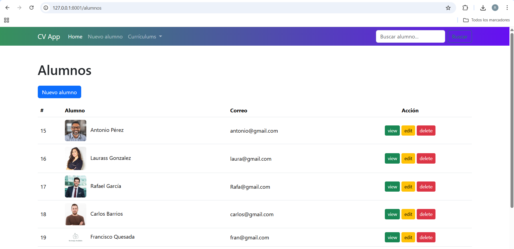
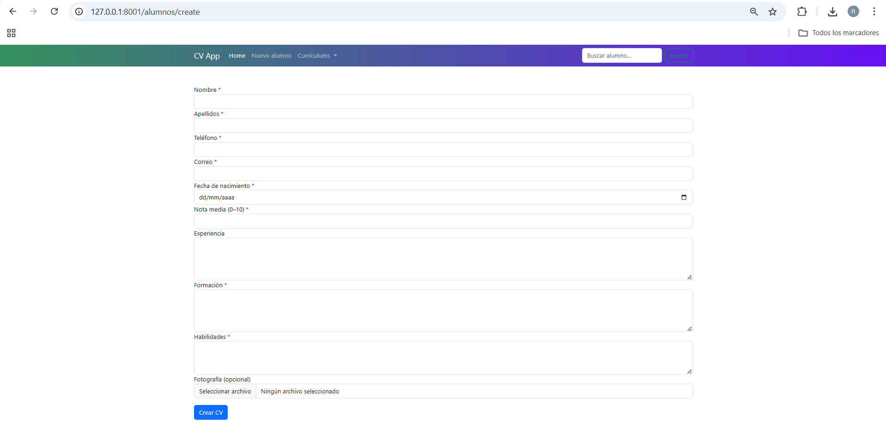

# CVApp – Es una aplicación web para gestionar los currículums de los alumnos con un proyecto que hemos realizado en Laravel

El proyecto se ha desarrollado con **Laravel** como práctica del módulo **Desarrollo Web en Entorno Servidor**.  
Se de crear una aplicación que recoja todos los métodos CRUD que nos va permitir realizar las acciones típicas de una aplicación web para cv **crear, visualizar, editar y eliminar** currículums. En las clases finales aprendimos tambien a incluir la **subida y gestión de imágenes**.

---

## Creación del proyecto

El proyecto se creó desde terminal en el servidor AWS aplicando los permisos necesarios para que Laravel y Apache funcionen sin problemas, los siguientes comandos forman la creacion del proyecto:

```bash
sudo mkdir /var/www/html/cvApp
cd /var/www/html/cvApp
composer create-project laravel/laravel .
sudo chown -R www-data:www-data /var/www/html/cvApp
```
## Configuración de la base de datos
Se creó una base de datos en MySQL llamada **cvapp** y se configuró el archivo `.env` con los datos de conexión a la base de datos:
```env
DB_CONNECTION=mysql
DB_HOST=127.0.0.1
DB_PORT=3306
DB_DATABASE=cvapp
DB_USERNAME=root
DB_PASSWORD=root

La BD se cre desde phpMyAdmin igual que en clases.
```      
## Migraciones y modelos
Se crearon las migraciones y modelos necesarios para la aplicación utilizando los siguientes comandos:
```bash
php artisan make:migration create_alumnos_table
php artisan migrate
```
El arhcivo create_alumnos define la tabla alumnos con su id, nombre, apellidos... tal y como dice el enunciado de la práctica.
``
## Archivos y carpetas principales

app/Models/Alumno.php: Modelo del alumno.
app/Http/Controllers/AlumnoController.php: Controlador para gestionar las operaciones CRUD.
resources/views/: Carpeta que contiene las vistas Blade para la interfaz de usuario.    
routes/web.php: Archivo de rutas para definir las URL de la aplicación.
public/storage/: Carpeta para almacenar las imágenes subidas por los usuarios.
routes/web.php: Archivo de rutas para definir las URL de la aplicación.

## Funcionalidades
- Crear, visualizar, editar y eliminar currículums de alumnos.
- Subida y gestión de imágenes para los currículums.
- Validación de formularios para asegurar la integridad de los datos.
- Buscador de alumnos por nombre o apellidos.
- Ventana modal para confirmar la eliminación de un currículum.
- Mensajes de exito o error tras realizar operaciones.

## Ejecución del proyecto
Para ejecutar el proyecto tenemos que que poner el comando 
```bash
php artisan serve
``` 
y luego acceder desde el navegador a http//127..0.0.1:8000
si lo abrimos desde aws tendremos que mirar nuestra ip publica al lanzar la instancia y poner justo despues  cvApp/public

## Capturas de pantalla
Muestro ahora algunas capturas de pantalla para comprobar el funcionamiento:




